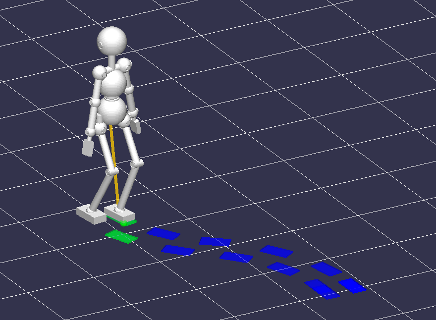

## Aim of this challenge
The aim fo this challenge is to facilitate cutting-edge research on humanoid robotics
 (motion planning, whole-body control, environmental sensing, etc...)
 by sharing knowledge and technical resources in the research community and
 encouraging students and researchers to tackle challenging problems through competition.

Several simulation-based humanoid robot competitions have been held in the past.
Compared to these events, This challenge is aiming at exploring the potential ability of humanoid robots to
perform acrobatic movements.

## Important Dates

- Website opening: early October 2021
- Preliminary challenge: December 2021, online
- Main challenge: March 2022, online

## Challenge Theme

## Rules

Choreonoid (<choreonoid.org>) is used for the simulation environment of this challenge.
Each team designs a robot model and a controller that can be loaded and run on Choreonoid.

It also implements the controller of the robot using the SimpleController interface of Choreonoid.

### Creating a robot model

- The model is recommended to be written in the .body format.
- The number of joints must not exceed 50.
- The type of joints may be revolute or prismatic.
- The total mass of the robot must be between 50-100 [kg].
- At the initial posture, the robot must be inside the box of X x Y x Z = 70cm x 70cm x 200cm.

### Implementation of a controller

- The controller should be implemented as a SimpleController of Choreonoid.
- The main controller could be implemented using some other framework such as ROS,
  and exchange information between Choreonoid over a communication bridge.

#### Actuation
- The actuation mode of each joint may be either Velocity or Torque.
  Torque mode is recommended for stable simulation.
- Only joints can be directly actuated.
  Directly actuating the links (the rigid bodes) is not permitted in the trial (use it for test purpose only).
  
#### Sensing
- Various sensor nodes supported by Choreonoid such as ForceSensor, RateGyroSensor, and AccelerationSensor, may be used.
  The number of sensors is not limited.
- The position and velocity of joints can be retrieved through the SimpleControllerIO interface.
- Retrieving the absolute position and orientation of links (rigid bodies) is also permitted
  (there is no need for position/posture estimation).

### Simulator setting
- The AISTsimulator physics engine for simulation.
- Switching to other physics engines. or changing the parameters of the AISTsimulator is not permitted in the trial.
- A sample .cnoid project file is provided.
  Use the simulator setting described in this file for the trial.

### Teleoperation of the robot
- 

## Quick Start

## Asking Questions

